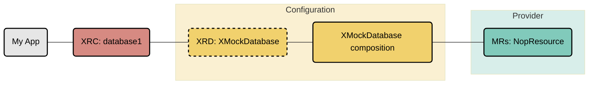

# configuration-quickstart

An introductory example to Crossplane and Compositions using provider-nop. This enables provisioning of several different fake resource types for testing and educational purposes.

This repository contains a reference configuration for [Crossplane](https://crossplane.io). This configuration uses [provider-nop](https://github.com/crossplane-contrib/provider-nop), a Crossplane provider that simulates the creation of external resources.

## Overview

The configuration offers an API for setting up a mock database resource. This configuration also demonstrates the power of Crossplane to build abstractions called `compositions`, which assemble multiple basic resources into a more complex resource.

Learn more about Composite Resources in the [Crossplane
Docs](https://docs.crossplane.io/latest/concepts/compositions/).



## Quickstart

### Prerequisites

Before you can install the Configuration, you should install the `crossplane` CLI. This is a utility that makes following this quickstart guide easier. Everything described here can also be done in a declarative approach - which we highly recommend for any production type use-case.
<!-- TODO enhance this guide: Getting ready for Gitops -->

To install `crossplane` run this install script:
```console
curl -sL "https://raw.githubusercontent.com/crossplane/crossplane/main/install.sh" | sh
```
See [crossplane CLI docs](https://docs.crossplane.io/latest/cli/#installing-the-cli) for additional information.

You need a running Crossplane control plane to install the Configuration into.
Ensure that your kubectl context points to the correct Kubernetes cluster or
create a new [kind](https://kind.sigs.k8s.io) cluster:

```console
kind create cluster
```

Enable the Crossplane Helm Chart repository:

```console
helm repo add crossplane-stable https://charts.crossplane.io/stable
helm repo update
```

Install the Crossplane components using helm install:

```console
helm install crossplane \
crossplane-stable/crossplane \
--namespace crossplane-system \
--create-namespace
```

### Install the Quickstart configuration

Now you can install this configuration. It's packaged as a [Crossplane
configuration package](https://docs.crossplane.io/latest/concepts/packages/)
so there is a single command to install it:

```console
crossplane xpkg install configuration xpkg.crossplane.io/crossplane-contrib/configuration-quickstart:v0.1.0
```

Validate the install by inspecting the provider and configuration packages:
```console
kubectl get providers,providerrevision

kubectl get configurations,configurationrevisions
```

## Using the Quickstart configuration

🎉 Congratulations. You have just installed your first Crossplane-powered platform.

You can now use the control plane to request resources which will simulate getting provisioned in an external cloud service. You do this by creating "claims" against the APIs available on your control plane. Following the example below, create the claims directly:

Create a mock database:
```console
kubectl apply -f examples/XMockDatabase/example.yaml
```

You can verify the status by inspecting the claims, composites and managed
resources:

```console
kubectl get claim,composite,managed
```

To delete the provisioned resources, delete the claims:

```console
kubectl delete -f examples/XMockDatabase/example.yaml
```

To uninstall the package and all dependencies:

```console
kubectl delete configurations.pkg.crossplane.io configuration-quickstart
```

## Questions?

For any questions, thoughts and comments [get involved](https://github.com/crossplane/crossplane?tab=readme-ov-file#get-involved) in the Crossplane community or drop by
[slack.crossplane.io](https://slack.crossplane.io) and introduce yourself.